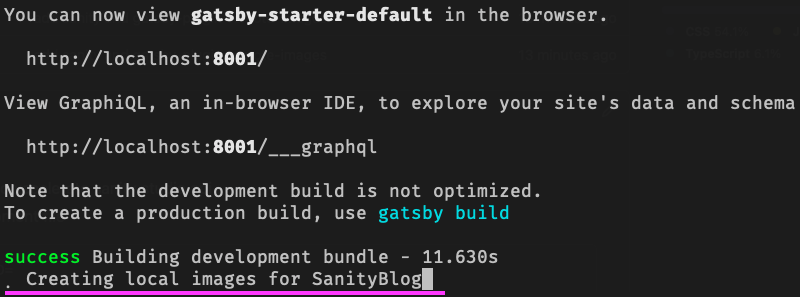

**Steps to reproduce**

1. make sure you have access to xccelerate sanity studio api
2. add following to .env.development file

```
SANITY_STUDIO_API_PROJECT_ID=
SANITY_STUDIO_API_DATASET=
SANITY_TOKEN=
```

3. run `gatsby clean && gatsby develop`

You should see 
